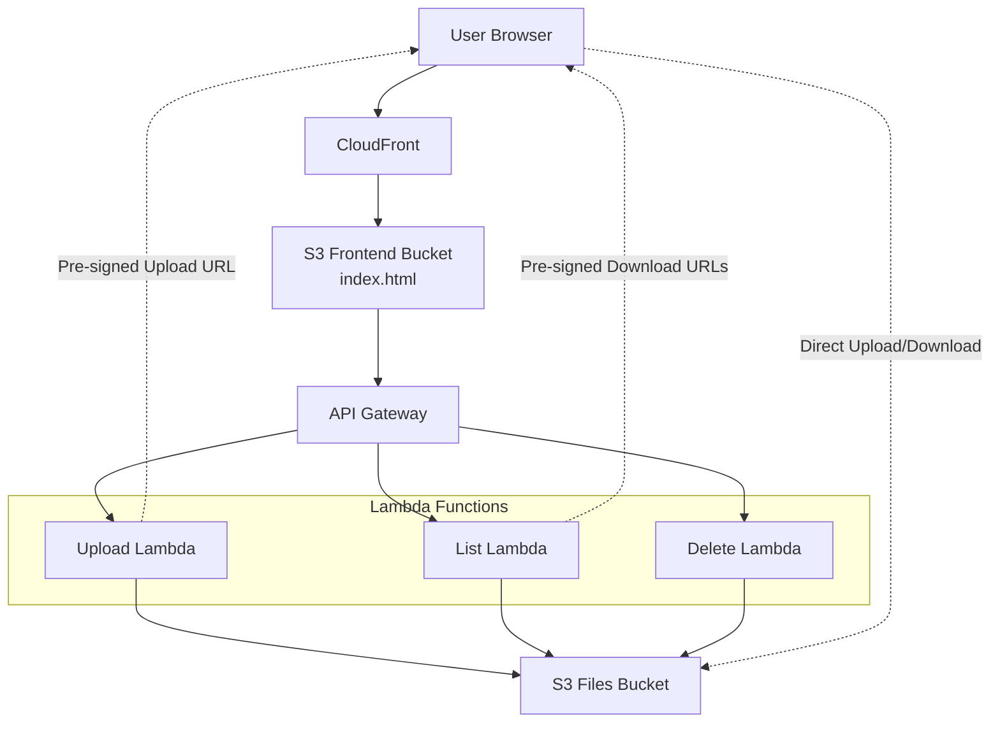
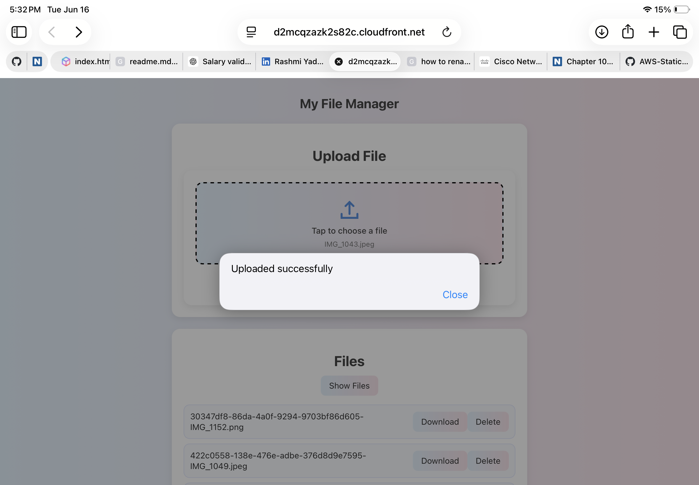
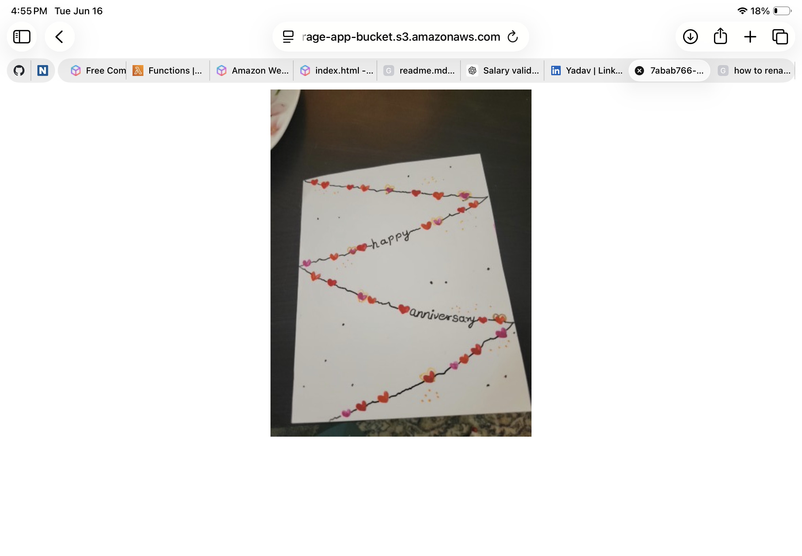

# AWS-Serverless-File-Manager
## Overview  
A serverless file management application that allows users to upload, list, download, and delete files through a web interface using Amazon S3, Lambda, API Gateway and pre-signed URLs.  
## Architecture  

## AWS Services Used:  
-Amazon Web Services  
-Amazon S3  
-AWS Lambda  
-Amazon API Gateway   
-Amazon CloudFront  

## Features:   
-Upload files using S3 pre-signed URLs  
-View uploaded files  
-Download files securely  
-Delete files  
-Responsive web interface  
-Fully serverless architecture  

## Implementation Steps:  
### Step1 :   
 Created an S3 bucket to store uploaded files and a separate S3 bucket to host the frontend.  
 ### Step 2:  
 Developed the frontend (`index.html`) for file upload, listing, download, and deletion.  
### Step 3:  
Created Lambda functions for generating pre-signed upload URLs, listing files with download URLs, and deleting files.  
### Step 4:  
Configured API Gateway routes and integrated them with the Lambda functions.  
### Step 5:  
Enabled CORS for seamless communication between the frontend and backend services.  
### Step 6:  
Deployed the frontend to S3 and configured CloudFront for secure content delivery.  
### Step 7:
Tested end-to-end functionality, including upload, download, list, and delete operations.  

## Security Best Practises:  
-Files are uploaded directly to S3 using time-limited pre-signed URLs.   
-CloudFront is used to securely distribute the frontend.  
-No long-term AWS credentials are exposed in the browser.  

## Screenshots:     
### Website Homepage

### File upload  

  

### Uploaded files list  

  

### Download functionality  

   

  

### Delete functionality  

  

  

