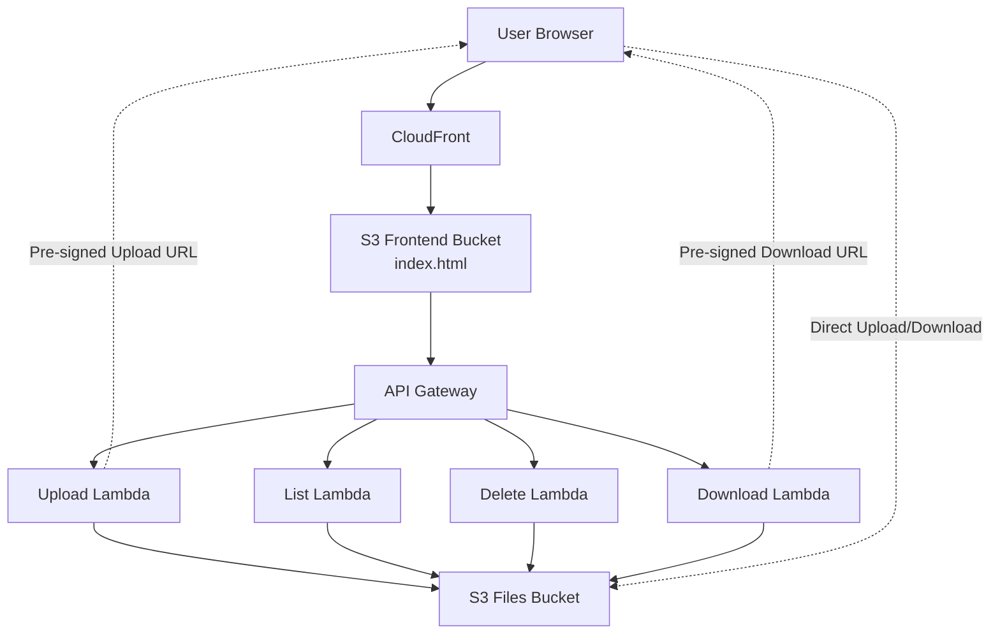

# AWS-Serverless-File-Manager
# Overview  
A serverless file management application that allows users to upload, list, download, and delete files through a web interface using Amazon S3 pre-signed URLs.  
# Architecture  
````mermaid. 
flowchart TD
    U[User Browser] --> CF[CloudFront]
    CF --> S3F[S3 Frontend Bucket<br/>index.html]
    S3F --> APIGW[API Gateway]

    APIGW --> UL[Upload Lambda]
    APIGW --> LL[List Lambda]
    APIGW --> DL[Delete Lambda]

    UL --> S3D[S3 Files Bucket]
    LL --> S3D
    DL --> S3D

    LL -. Returns pre-signed download URLs .-> U
    UL -. Returns pre-signed upload URL .-> U

    U -. Direct Upload/Download .-> S3D

Features
Upload files using S3 pre-signed URLs
View uploaded files
Download files securely
Delete files
Responsive web interface
Fully serverless architecture
AWS Services Used
Amazon Web Services
Amazon S3
AWS Lambda
Amazon API Gateway
Amazon CloudFront
Workflow
User accesses the web application through CloudFront.
The frontend requests a pre-signed upload URL from API Gateway.
Lambda generates the pre-signed URL.
The browser uploads the file directly to the S3 uploads bucket.
Users can list, download, and delete files using additional API endpoints backed by Lambda.
Security
Files are uploaded directly to S3 using time-limited pre-signed URLs.
CloudFront is used to securely distribute the frontend.
No long-term AWS credentials are exposed in the browser.
Screenshots to Upload
Include screenshots of:
Home page
File upload
Uploaded files list
Download functionality
Delete functionality
AWS architecture diagram (optional but highly recommended)
